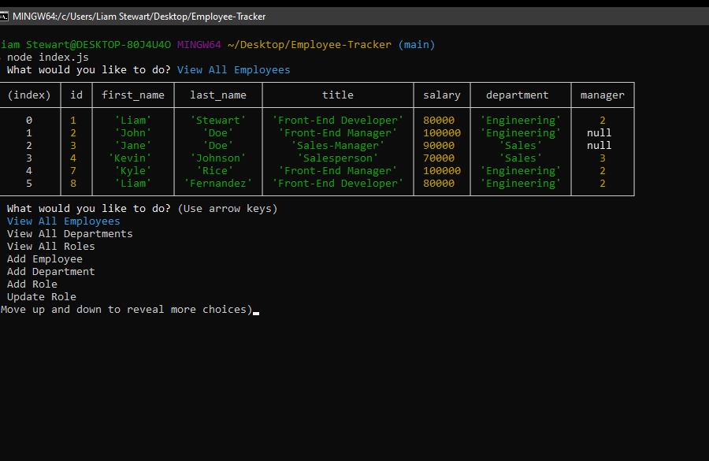

# Employee-Tracker

## Application-Picture



## Technologies Used
    - Javascript - Used to write the functions of the application
    - Nodejs - Multiple packages used for functionality.(inquirer)
    - MySQL - Relational database management system
    - Git - Version control system to track changes to source code
    - GitHub - Hosts repository that can be deployed to GitHub pages

## Summary
    This command line application will allow you to view, add, edit, and delete information in our database. In this case, we are tracking employees.

## Code Snippet
    Below is a code snippet from the function that allows us to view all employees and roles, pulling information from 3 tables in our database.

```

const viewAllEmployees = () => {
    let query =
        'SELECT employee.id, employee.first_name, employee.last_name, role.title, role.salary, department.name AS department, employee.manager_id AS manager ';
    query += 'FROM ((employee ';
    query += 'INNER JOIN role ON employee.role_id = role.id) ';
    query += 'INNER JOIN department ON role.department_id = department.id)';
    connection.query(query, (err, res) => {
        if (err) throw err;
        console.table(res);
        startTracking();
    });
};
```


## Author Links
[LinkedIn](https://www.linkedin.com/in/liamsctewart/)<br>
[Github](https://github.com/LiamStewart8)<br>